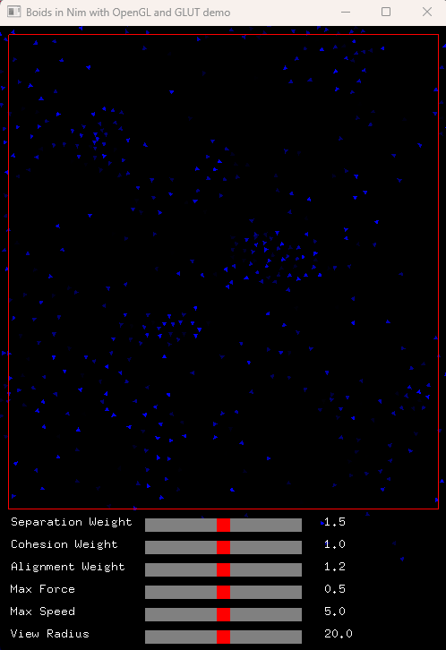

# Boids Simulation in Nim

A simple boids flocking simulation implemented using Nim, OpenGL, and GLUT.



## Features

- Simulates the flocking behavior of boids using the classic three rules: alignment, cohesion, and separation.
- Boids avoid walls when they get close to the screen boundaries.
- Each boid is rendered in a unique shade of blue for easier distinction.

## Installation and Setup

1. Ensure you have Nim, OpenGL, and GLUT installed on your machine.
2. Clone the repository:

```bash
git clone <repository-url>
```

Navigate to the project directory:

```bash
cd <repository-directory>
```

Compile and run the project:

```bash
nim c -r boids.nim
```

## Usage

Watch the boids flock and interact in real-time.
Adjust parameters like the number of boids, maximum speed, view radius, etc., in the source code to see how it affects the simulation.

## Dependencies and Required Libraries on Windows

To run the boids simulation on Windows, you'll primarily need the FreeGLUT library:

### FreeGLUT (The Free OpenGL Utility Toolkit)

FreeGLUT is an open-source alternative to the original GLUT library. It provides a portable API for handling window creation, input events, and other tasks useful for OpenGL-based applications.

**Required DLL**: `freeglut.dll` (64-bit) or `freeglut32.dll` (32-bit).

### Installation Instructions

1. Ensure you have FreeGLUT installed on your system.
2. Place the `freeglut.dll` file (if not already present) in the same directory as your executable or in a directory listed in your system's `PATH` environment variable.

## License

This project is licensed under the GPL3 License - see the [LICENSE](LICENSE) file for details.

## Acknowledgments

- Craig Reynolds for the original boids algorithm.
- OpenAI for guidance and suggestions in refining the simulation.
